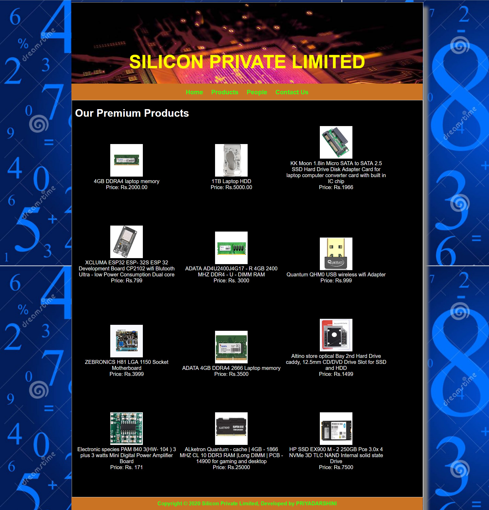
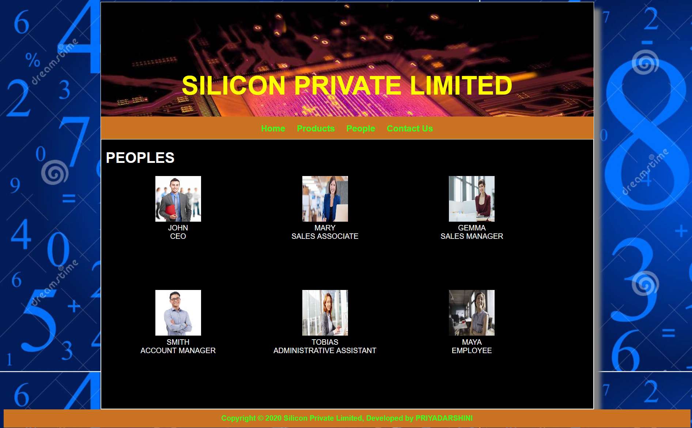
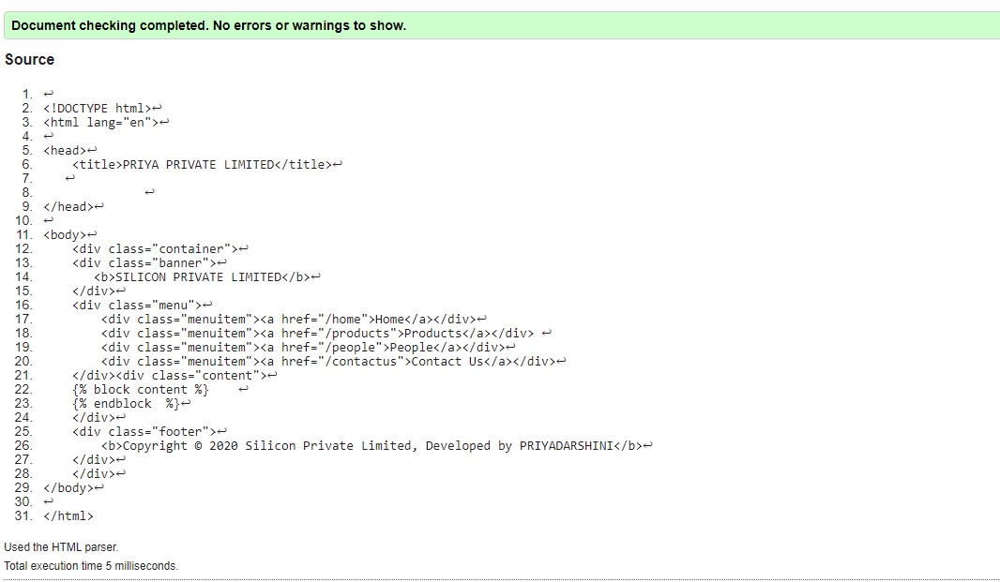
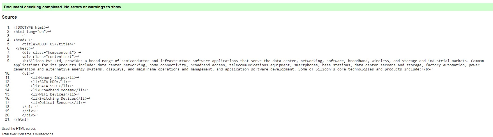
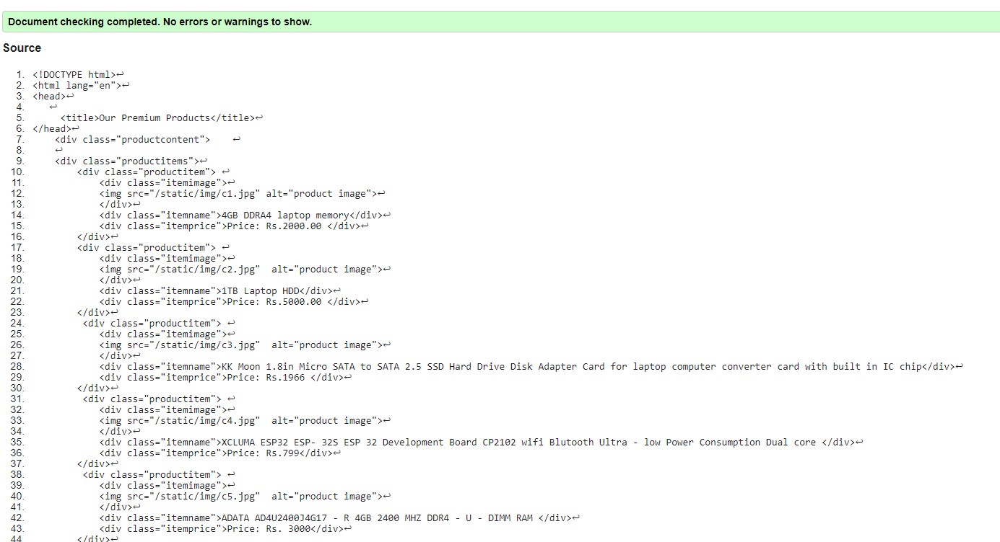
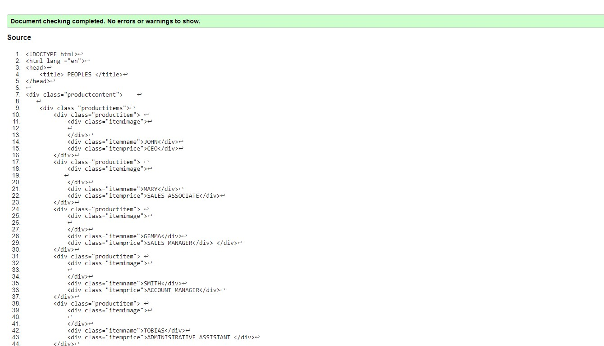
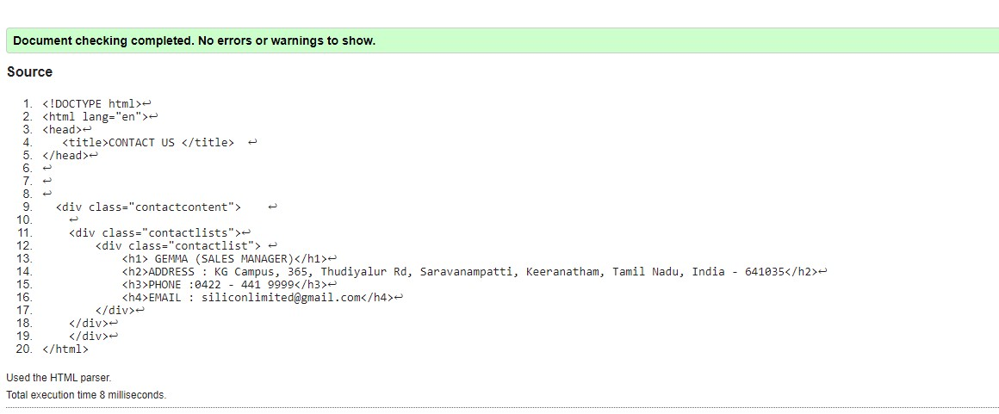

# Web Design for a Manufacturing Company
## AIM: 
To design a static website for a chip manufacturing company.

## DESIGN STEPS:
### Step 1: 
Requirement collection.
### Step 2:
Creating the layout using HTML and CSS.
### Step 3:
Updating the sample content.
### Step 4:
Choose the appropriate style and color scheme.
### Step 5:
Validate the layout in various browsers.
### Step 6:
Validate the HTML code.
### Step 6:
Publish the website in the given URL.

## PROGRAM:

### base.html
```

<!DOCTYPE html>
<html lang="en">

<head>
    <title>PRIYA PRIVATE LIMITED</title>
    <link rel="stylesheet" href="">
   
    <link rel = "icon" href ="" type = "image/x-icon"> 
              
</head>

<body>
    <div class="container">
    <div class="banner">
       <b>SILICON PRIVATE LIMITED</b>
    </div>
    <div class="menu">
        <b><div class="menuitem"><a href="/home">Home</a></div></b>
        <b><div class="menuitem"><a href="/products">Products</a></div></b> 
        <b><div class="menuitem"><a href="/people">People</a></div></b>
        <b><div class="menuitem"><a href="/contactus">Contact Us</a></div></b>
    </div><div class="content">
        
    
    </div>
    <div class="footer">
        <b>Copyright © 2020 Silicon Private Limited, Developed by PRIYADARSHINI</b>
    </div>
    </div>
</body>

</html>
```

### home.html
```



    <div class="homecontent">    
    <h1><b>ABOUT US </b></h1>
    
    <div class="contenttext">
    <b>Silicon Pvt Ltd, provides a broad range of semiconductor and infrastructure software applications that serve the data center, networking, software, broadband, wireless, and storage and industrial markets. Common applications for its products include: data center networking, home connectivity, broadband access, telecommunications equipment, smartphones, base stations, data center servers and storage, factory automation, power generation and alternative energy systems, displays, and mainframe operations and management, and application software development. Some of Silicon's core technologies and products include:</b>
    <ul>
        <b><li>Memory Chips</li></b>
        <b><li>SATA HDD</li></b>
        <b><li>SATA SSD </li></b>
        <b><li>Broadband Modems</li></b>
        <b><li>Wifi Devices</li></b>
        <b><li>Switching Devices</li></b>
        <b><li>Optical Sensors</li></b>
    </ul> 
    </div>
    </div>

```

### product.html
```




    <div class="productcontent">    
    <h1>Our Premium Products</h1>
    <div class="productitems">
        <div class="productitem"> 
            <div class="itemimage">
            
            </div>
            <div class="itemname">4GB DDRA4 laptop memory</div>
            <div class="itemprice">Price: Rs.2000.00 </div>
        </div>
        <div class="productitem"> 
            <div class="itemimage">
            
            </div>
            <div class="itemname">1TB Laptop HDD</div>
            <div class="itemprice">Price: Rs.5000.00 </div>
        </div>
         <div class="productitem"> 
            <div class="itemimage">
            
            </div>
            <div class="itemname">KK Moon 1.8in Micro SATA to SATA 2.5 SSD Hard Drive Disk Adapter Card for laptop computer converter card with built in IC chip</div>
            <div class="itemprice">Price: Rs.1966 </div>
        </div>
         <div class="productitem"> 
            <div class="itemimage">
            
            </div>
            <div class="itemname">XCLUMA ESP32 ESP- 32S ESP 32 Development Board CP2102 wifi Blutooth Ultra - low Power Consumption Dual core </div>
            <div class="itemprice">Price: Rs.799</div>
        </div>
         <div class="productitem"> 
            <div class="itemimage">
            
            </div>
            <div class="itemname">ADATA AD4U2400J4G17 - R 4GB 2400 MHZ DDR4 - U - DIMM RAM </div>
            <div class="itemprice">Price: Rs. 3000</div>
        </div>
         <div class="productitem"> 
            <div class="itemimage">
            
            </div>
            <div class="itemname">Quantum QHM0 USB wireless wifi Adapter </div>
            <div class="itemprice">Price: Rs.999</div>
        </div>
         <div class="productitem"> 
            <div class="itemimage">
            
            </div>
            <div class="itemname">ZEBRONICS H81 LGA 1150 Socket Motherboard</div>
            <div class="itemprice">Price: Rs.3999</div>
        </div>
        <div class="productitem"> 
            <div class="itemimage">
            
            </div>
            <div class="itemname">ADATA 4GB DDRA4 2666 Laptop memory </div>
            <div class="itemprice">Price: Rs.3500</div>
        </div>
         <div class="productitem"> 
            <div class="itemimage">
            
            </div>
            <div class="itemname">Altino store optical Bay 2nd Hard Drive caddy, 12.5mm CD/DVD Drive Slot for SSD and HDD</div>
            <div class="itemprice">Price: Rs.1499 </div>
        </div>
         <div class="productitem"> 
            <div class="itemimage">
            
            </div>
            <div class="itemname">Electronic species PAM 840 3(HW- 104 ) 3 plus 3 watts Mini Digital Power Amplifier Board</div>
            <div class="itemprice">Price: Rs. 171</div>
        </div>
        <div class="productitem"> 
            <div class="itemimage">
            
            </div>
            <div class="itemname">ALketron Quantum - cache | 4GB - 1866 MHZ CL 10 DDR3 RAM |Long DIMM | PCB - 14900 for gaming and desktop</div>
            <div class="itemprice">Price: Rs.25000 </div>
        </div>
         <div class="productitem"> 
            <div class="itemimage">
            
            </div>
            <div class="itemname">HP SSD EX900 M - 2 250GB Pce 3.0x 4 NVMe 3D TLC NAND Internal solid state Drive</div>
            <div class="itemprice">Price: Rs.7500</div>
        </div>
         
    </div>
    </div>

```
### people.html
```






<div class="productcontent">    
    <h1>PEOPLES</h1>
    <div class="productitems">
        <div class="productitem"> 
            <div class="itemimage">
            
            </div>
            <div class="itemname">JOHN</div>
            <div class="itemprice">CEO</div>
        </div>
        <div class="productitem"> 
            <div class="itemimage">
            
            </div>
            <div class="itemname">MARY</div>
            <div class="itemprice">SALES ASSOCIATE</div>
        </div>
        <div class="productitem"> 
            <div class="itemimage">
            
            </div>
            <div class="itemname">GEMMA</div>
            <div class="itemprice">SALES MANAGER</div> </div>
        </div>
        <div class="productitem"> 
            <div class="itemimage">
            
            </div>
            <div class="itemname">SMITH</div>
            <div class="itemprice">ACCOUNT MANAGER</div>
        </div>
        <div class="productitem"> 
            <div class="itemimage">
            
            </div>
            <div class="itemname">TOBIAS</div>
            <div class="itemprice">ADMINISTRATIVE ASSISTANT </div>
        </div>
        <div class="productitem"> 
            <div class="itemimage">
            
            </div>
            <div class="itemname">MAYA</div>
            <div class="itemprice">EMPLOYEE</div>
        </div>
    </div>
</div>


```

### contact.html
```





    <div class="contactcontent">    
    <h1>CONTACT US</h1>
    <div class="contactlists">
        <div class="contactlist"> 
            <h1> GEMMA (SALES MANAGER)</h1>
            <h2>ADDRESS : KG Campus, 365, Thudiyalur Rd, Saravanampatti, Keeranatham, Tamil Nadu, India - 641035</h2>
            <h3>PHONE :0422 - 441 9999</h3>
            <h4>EMAIL : siliconlimited@gmail.com</h4>
        </div>
    </div>
    </div>


```


## OUTPUT:







## CODE VALIDATION REPORT:










## RESULT:
Thus a website is designed for the chip manufacturing company and is hosted in the URL http://priyadarshini.student.saveetha.in:8000. HTML code is validated.